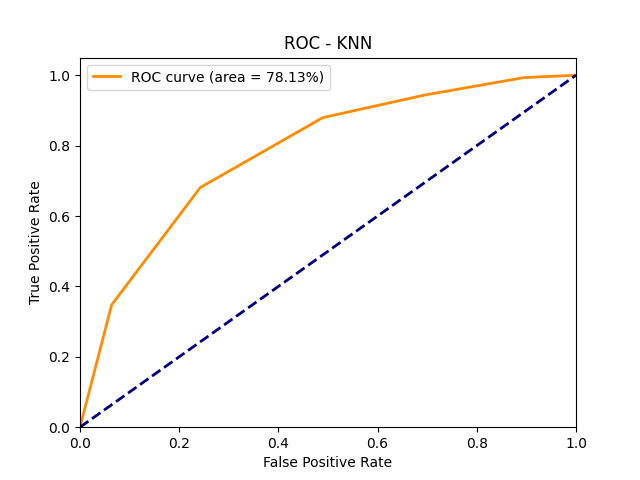
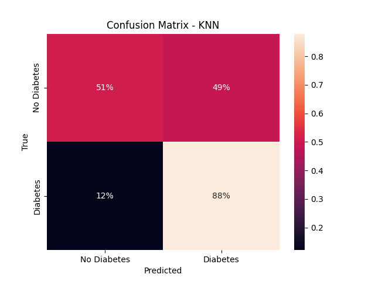

# Diabetes Test Application

In this project, an application aimed at predicting diabetic status using a machine learning algorithm was developed. The project involved several key steps, including data collection, preprocessing, model training, and evaluation to identify the best performing algorithm. The chosen model was then deployed for real-time prediction of diabetic status. 

## Key Components of the Project:

#### 1. Data Collection and Preprocessing
* Data Source: The data was sourced from [UCI](https://archive.ics.uci.edu/), which included various features relevant to diabetes prediction, such as Patient's Demographic Information, Vital Signs and Lab Results, Lifestyle Factors, Medical History, Medications, Quality of Life and Environmental Factors, Symptoms etc.
* Data Cleaning: The data underwent extensive cleaning to handle missing values, outliers, and data inconsistencies.
* Feature Engineering: New features were created from the existing ones to improve model performance.

#### 2. Model Training and Evaluation:
* Algorithms Tested: Logistic Regression, Random Forests, XGBoost, and K-Nearest Neighbor.
* Performance Metrics: Accuracy, precision, recall, F1-score, and AUC-ROC
* Hyperparameter Tuning: K-Fold Cross-validation was used to determine the best model. Then, Grid Search algorith was employed to fine-tune the best model for optimal performance.

#### 3. Model Deployment:
* Best Model Selection: `XGBoost` demonstrated the highest accuracy and reliability in predicting diabetic status, and hence was selected for deployment.
* Real-Time Prediction: The selected model was integrated into a Flask web application, enabling real-time prediction of diabetic status based on user inputs.
* User Interface: A user-friendly interface was developed using HTML, and CSS, allowing users to input relevant data and receive instant predictions.

#### 4. Database Integration:
* Data Storage: User specific inputs and prediction results are stored in a SQLite database for future reference and analysis.

#### 5. Additional Features:
* Error Handling: The application includes error handling to manage invalid inputs and provide meaningful feedback to users.
* Responsive Design: The interface is designed to be responsive, ensuring compatibility with various devices and screen sizes.
* Visualization: Tooltips were included to help users understand their data.

### Technologies Used:
* Tools: Python, HTML, CSS
* Frameworks and Libraries: Flask, Scikit-learn, Pandas, NumPy, SQLAlchemy,Boostrap, JQuery
* Database: SQLite
* Version Control: Git

**Model Development**: Check the [model development](model%20development.ipynb) for detailed data analysis and modelling steps.

## Model Performance
---

### Logistic Regression


### Random Forest


### XGBoost


### KNN






## Performance Metrics Summary
||Logistic Regression|Random Forest| XGBoost|K-Nearest Neighbor
|-|:-:|:-:|:-:|:-:
|Accuracy|83%|92%|94%|77%
|Precision|79%|94%|98%|73%
|Recall|79%|85%|89%|67%
|F1 Score|79%|89%|93%|70%
|ROC AUC|90%|95%|97%|80%


## Model Deployment

### Prerequisites

- Python 3.10-3.12
- Pip (Python package installer)

### Setup

1. **Clone the repository:**

    ```sh
    git clone https://github.com/rojuadeyemi/diabetes-test-app.git
    cd diabetes-test-app
    ```

2. **Create a virtual environment:**

Use the provided `Makefile` to create a virtual environment, and install dependencies by running `make` or `make all`.

You can also create a virtual environment manually using the following approach.

For *Linux/Mac*:

```sh
python -m venv .venv
source .venv/bin/activate 
```

For *Windows*:
    
```sh
python -m venv .venv
.venv\Scripts\activate
```

3. **Install the required dependencies:**

    ```sh
    pip install -U pip
    pip install -r requirements.txt
    ```

### Running the Application Locally

Before launching the application, the database is setup by running `make db_setup` using the provided `Makefile` or running the commands below on the console.

```sh
flask db init
flask db migrate -m "Initial migration."
flask db upgrade  
```

Then start the *Flask development server* by using the command `make develop`. You can also use the following commands:

For *Linux/Mac*:
```sh
export FLASK_APP=app.py
export FLASK_ENV=development
export FLASK_DEBUG=1
flask run   
```
For *Windows*:
```sh
set FLASK_APP=app.py
set FLASK_ENV=development
set FLASK_DEBUG=1
flask run
```

Then open your web browser and navigate to `<http://127.0.0.1:5000/>` to access the aplication.


After filling out the form, then click `CHECK STATUS`.


## Thank you!
